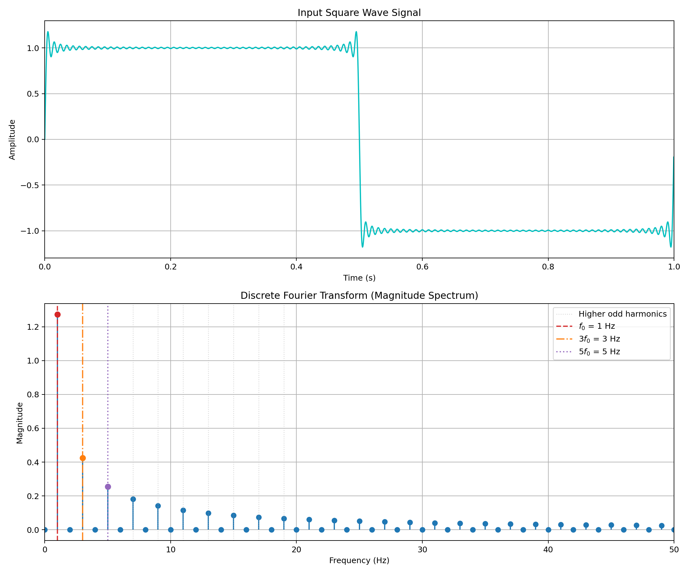
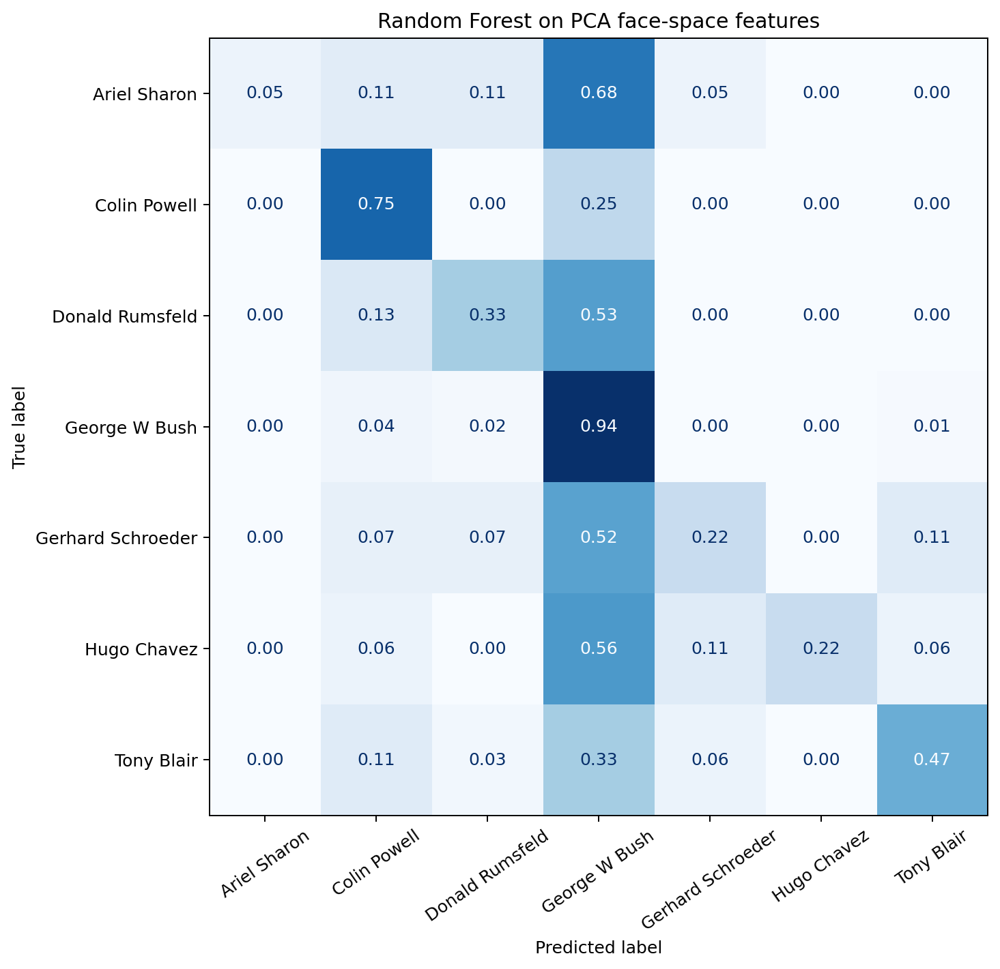
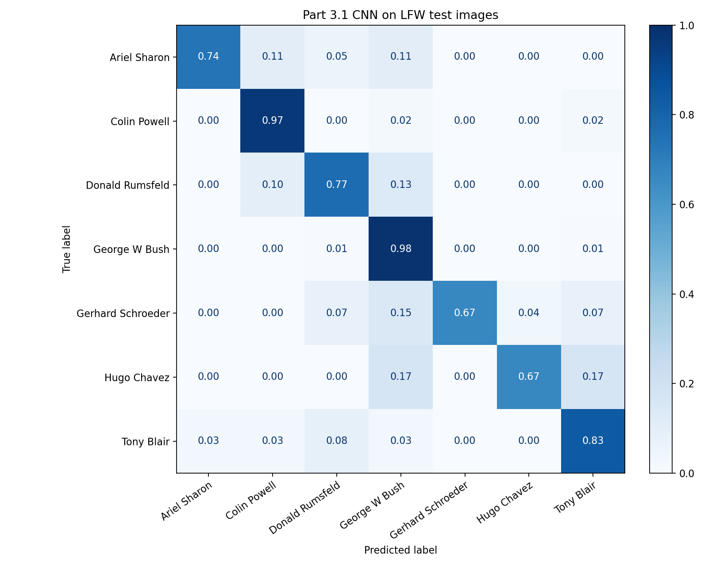
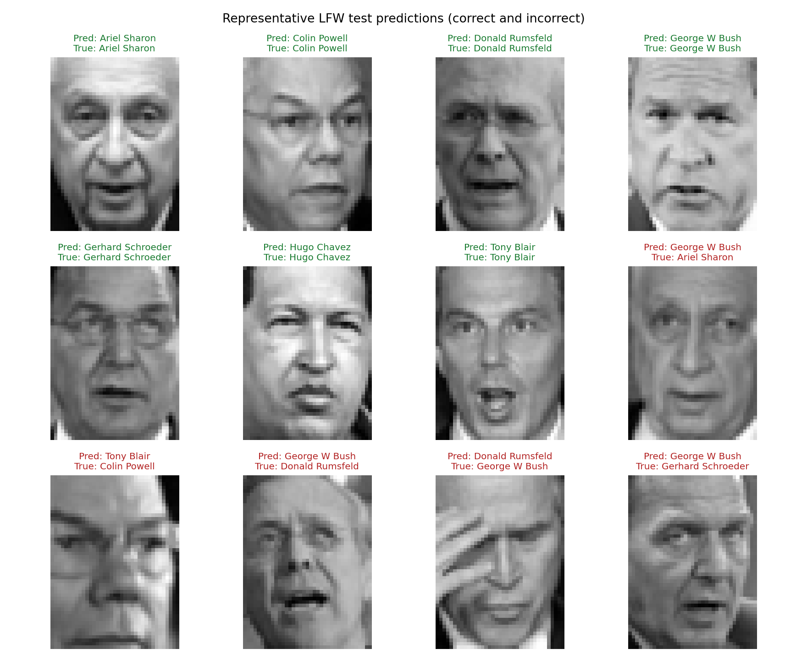

# COMP3710 Demo 2 — Pattern Recognition

PyTorch and NumPy implementations for the four parts of the COMP3710 Pattern
Recognition demonstration.

## Current progress

- [x] Project structure and reproducible local environment
- [x] Part 1: Fourier-series reconstruction and DFT benchmarks
- [x] Part 2: Eigenfaces and Random Forest classification
- [x] Part 3.1: LFW CNN classifier
- [ ] Part 3.2: DAWNBench ResNet-18 on CIFAR-10
- [ ] Part 4: VAE, UNet, and optional GAN on OASIS

## Environment

The project is being developed with Python 3.13 and PyTorch. Install the
dependencies into a virtual environment before running the experiments:

```bash
python -m pip install -r requirements.txt
```

Large datasets and model checkpoints are excluded from Git. A small set of
representative Part 1 results is retained as assessment evidence.

## Part 1 — Fourier series and DFT

Run the complete experiment from the repository root:

```bash
python -m part1_dft.main
```

The command creates the following reproducible evidence under `outputs/part1/`:

- `reconstructions.png`: square-wave approximations with increasing odd terms;
- `spectrum.png`: the odd-harmonic magnitude spectrum;
- `harmonics.csv`: expected Fourier coefficients compared with measured DFT bins;
- `benchmark.csv`: raw NumPy, FFT, and PyTorch timing results;
- `benchmark.png`: runtime growth comparison;
- `summary.json`: experiment parameters, device, and numerical verification.

The square wave, Fourier series, and direct DFT all have explicit PyTorch
implementations. The DFT evaluates its basis without using `torch.fft`. By
default the program selects CUDA, then Apple MPS, then CPU. Override this for a
reproducible CPU run with:

```bash
python -m part1_dft.main --device cpu --repeats 3
```

Run the Part 1 tests with:

```bash
python -m pytest tests/test_part1_dft.py -q
```

### Part 1 results





## Part 2 — Eigenfaces and Random Forest

Run the LFW experiment from the repository root:

```bash
python -m part2_eigenfaces.main
```

The first run downloads the funneled LFW dataset into the ignored `data/`
directory. PCA is fitted with NumPy SVD using only the stratified training split;
the same training mean and eigenfaces are then used to transform the test split.
The projected face-space features are classified with a reproducible Random
Forest. Figures, predictions, and metrics are written to `outputs/part2/`.

With the assignment parameters, 150 components explain 94.65% of the training
variance and the Random Forest achieves 64.29% test accuracy. The confusion
matrix shows that class imbalance favours the majority identity, so the
per-class report is retained alongside the aggregate score.

Run its unit tests with:

```bash
python -m pytest tests/test_part2_eigenfaces.py -q
```




## Part 3.1 — LFW convolutional classifier

Run the course-specified face CNN with automatic CUDA/MPS/CPU selection:

```bash
python -m part3_cnn.lfw_cnn
```

The network follows the slide architecture: two `3x3`, 32-channel convolution
blocks with batch normalisation, ReLU, and `2x2` max pooling, followed by a
dense layer, dropout, and seven output classes. Training, validation, and test
indices are stratified. Normalisation statistics and model selection use no test
data. The best validation checkpoint is evaluated on the test set only once.

On Apple MPS, the 453,031-parameter model reached 88.51% test accuracy after 25
epochs (macro F1 83.71%, weighted F1 88.14%). The checkpoint is kept locally in
the ignored `checkpoints/` directory; compact evidence is retained in
`outputs/part3_lfw/`.

Run its unit tests with:

```bash
python -m pytest tests/test_part3_cnn.py -q
```





