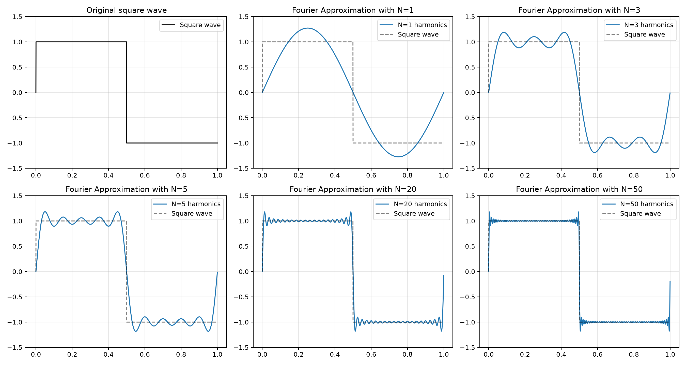
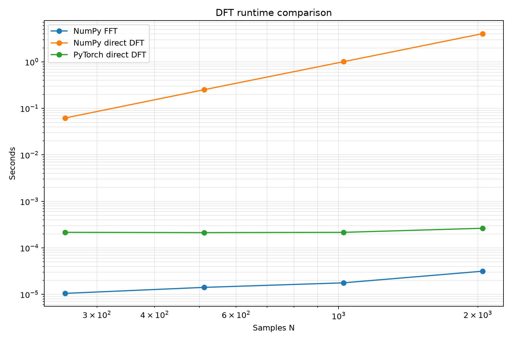
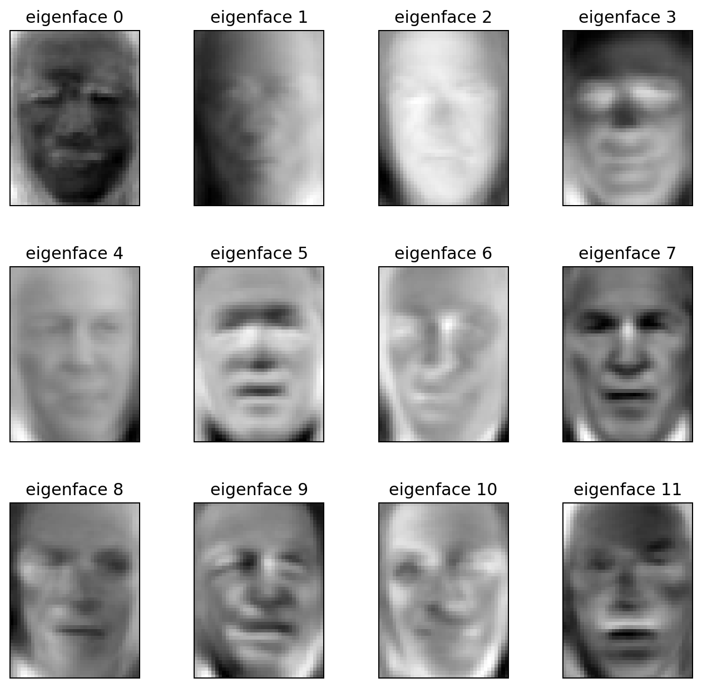
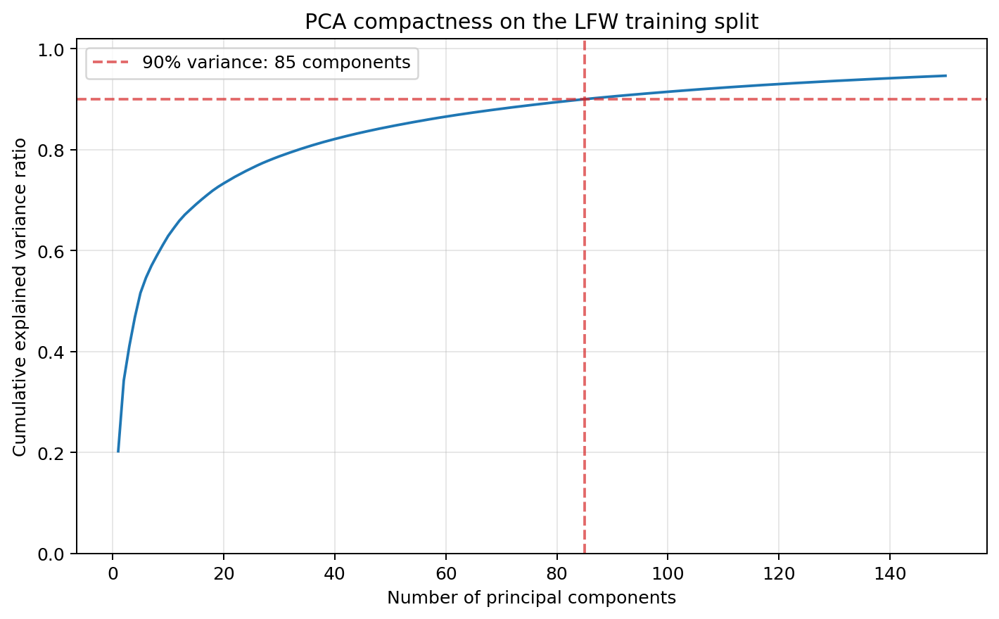
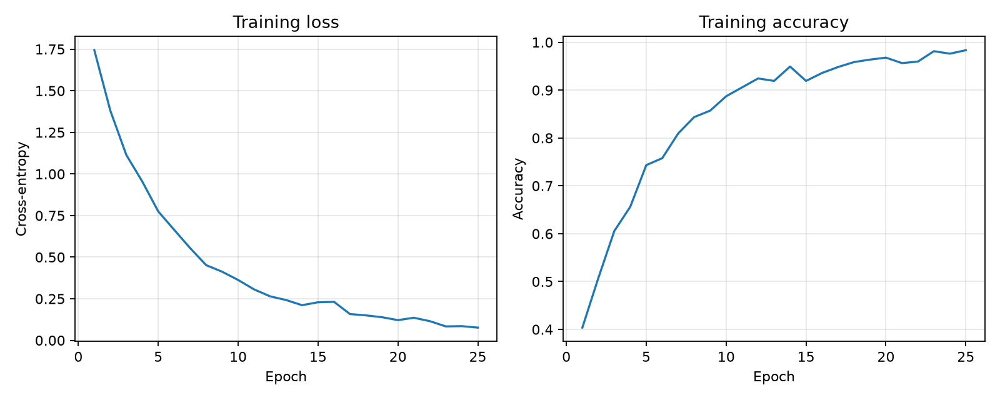
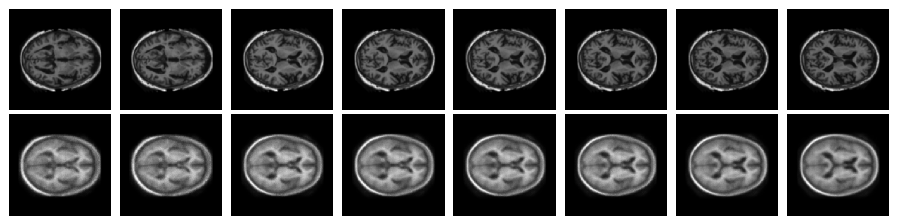
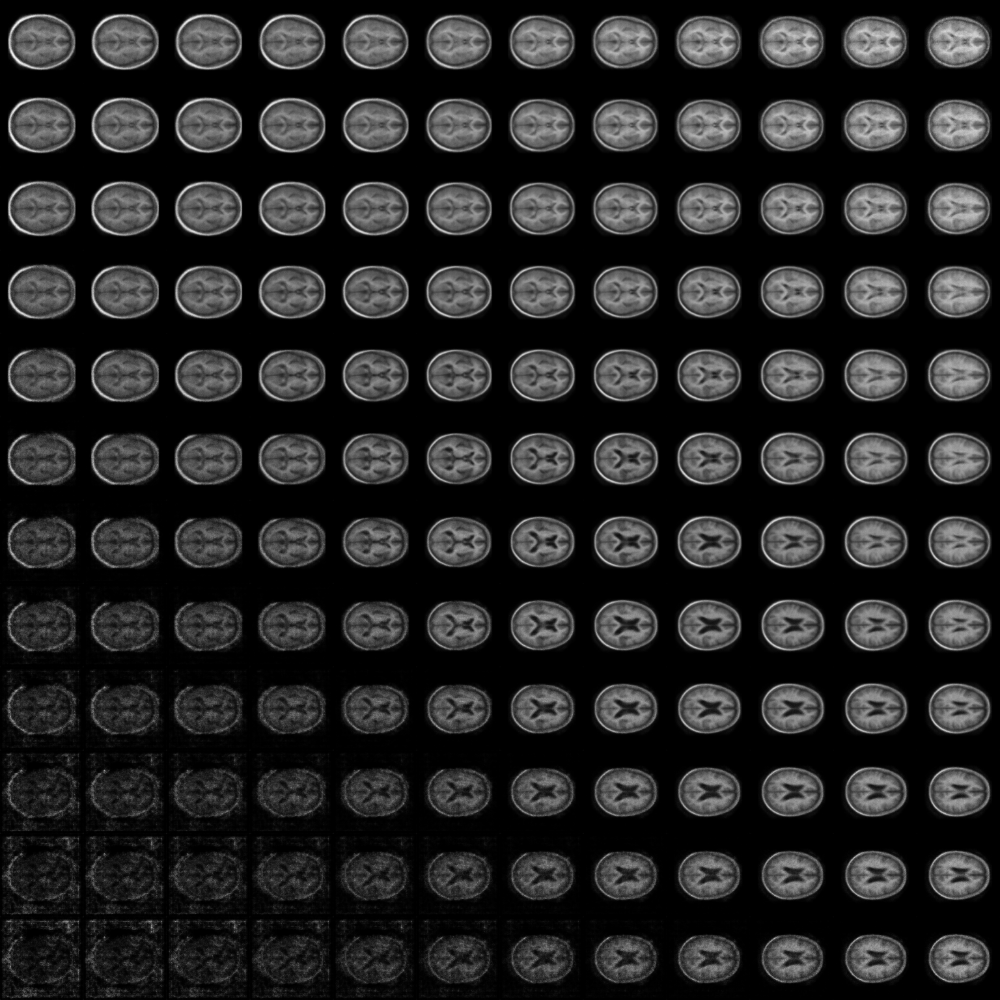
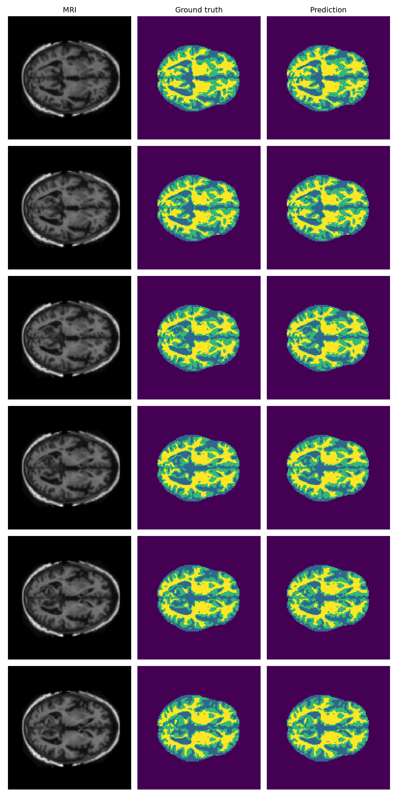
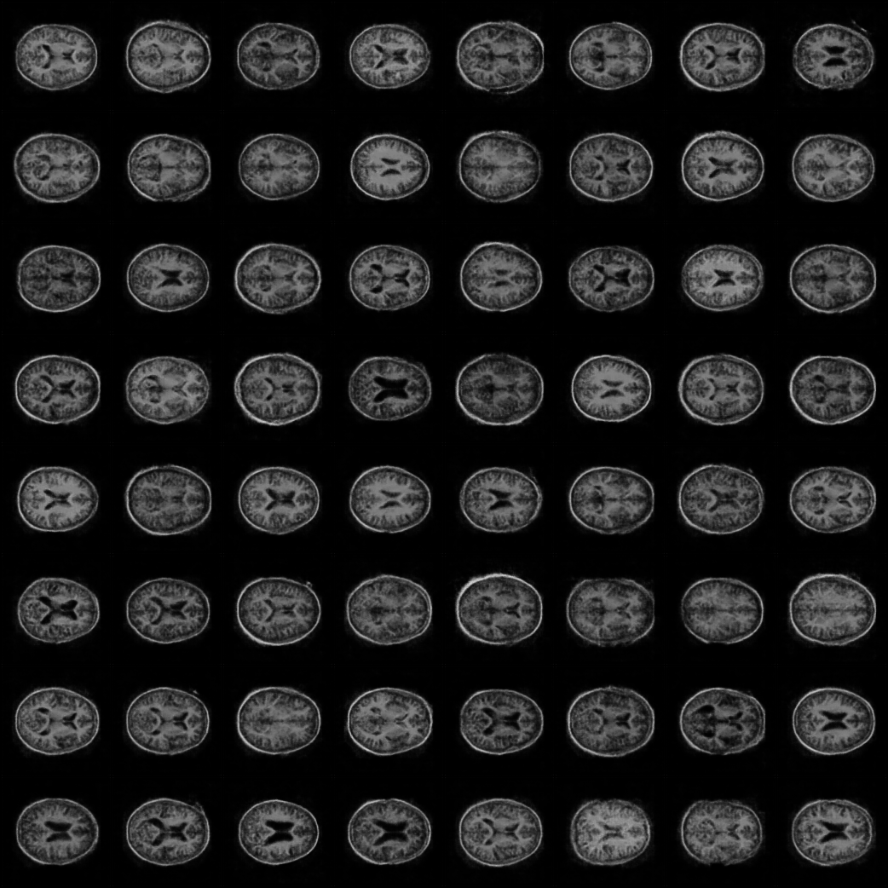
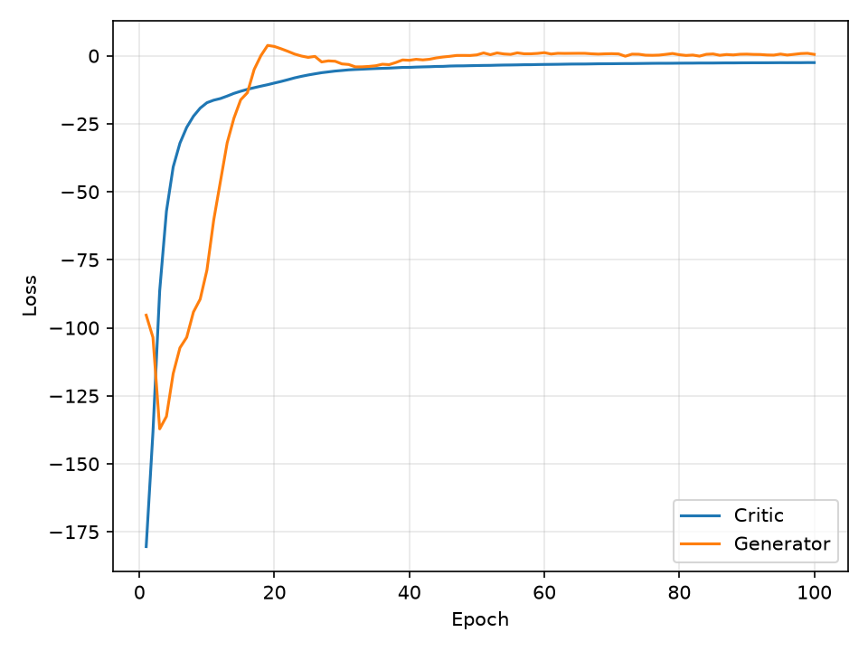

# COMP3710 Demo 2

My code and results for COMP3710 Lab Demonstration 2.

## Progress

- [x] Part 1 — Fourier series and DFT
- [x] Part 2 — Eigenfaces and Random Forest
- [x] Part 3.1 — LFW CNN
- [x] Part 3.2 — CIFAR-10 ResNet-18
- [ ] Part 4.1 — Version Control for Teams using Git (in progress)
- [x] Part 4.4 — VAE, U-Net and GAN on OASIS

## Setup

I used Python, NumPy, scikit-learn and PyTorch. Install the packages with:

```bash
python -m pip install -r requirements.txt
```

Datasets and model checkpoints are not uploaded to GitHub because they are large.

## Part 1 — Fourier series and DFT

```bash
python -m part1_dft.main
```

This script:

- reconstructs a square wave with 1, 3, 5, 20 and 50 odd Fourier terms;
- implements the direct DFT with NumPy loops;
- implements the same direct DFT with PyTorch tensor operations;
- compares both direct methods with NumPy FFT for different values of `N`.

The PyTorch DFT does not use a built-in FFT. It runs on CUDA, Apple MPS or CPU.
All results matched the FFT reference. In the Rangpur CUDA result, NumPy FFT was
fastest, followed by the PyTorch direct DFT, then the NumPy direct DFT.





## Part 2 — Eigenfaces

```bash
python -m part2_eigenfaces.main
```

I used the LFW dataset with a stratified 75/25 split. The training mean is used
to centre both sets, and NumPy SVD is used to keep 150 eigenfaces. A Random
Forest then classifies the projected face features using the parameters from
the lab sheet.

The first 150 components keep about **94.65%** of the variance. The saved Random
Forest test accuracy is **64.29%**.





The full classification report is in
[`outputs/part2/classification_report.txt`](outputs/part2/classification_report.txt).

## Part 3.1 — LFW CNN

```bash
python -m part3_cnn.lfw_cnn
```

The CNN has the two required `3x3` convolution layers with 32 filters each,
followed by dense classification layers. It uses Adam and cross-entropy loss.
The final Apple MPS run achieved **93.17% test accuracy**.



## Part 3.2 — CIFAR-10 ResNet-18

I implemented ResNet-18 from scratch instead of importing a pretrained model.
The Rangpur run used mixed precision on an NVIDIA A100.

Result:

- test accuracy: **94.03%**;
- total training and evaluation time: **194.9 seconds**;
- test inference time: **1.04 seconds**.

Example training submission:

```bash
sbatch scripts/rangpur_job.slurm \
  part3_cnn/dawnbench_resnet18.py \
  --device cuda --download \
  --output-dir outputs/part3_cifar10_comp3710 \
  --checkpoint checkpoints/part3_cifar10_resnet18_comp3710.pt
```

The PDF also requires inference and one training epoch to be demonstrated on
Rangpur. I will run these live using the saved checkpoint without overwriting
the reported result.

## Part 4.1 — Advanced Git Course

The required second Git short course, **Version Control for Teams using Git**,
is currently in progress. Completion evidence will be shown during the demo.

## Part 4.4 — OASIS recognition tasks

The Part 4 scripts accept the OASIS ZIP file or its extracted folder through
`--data-source`.

```bash
OASIS_PATH="/path/to/keras_png_slices_data.zip"
```

### VAE

```bash
sbatch scripts/rangpur_job.slurm part4_recognition/vae.py \
  --device cuda --data-source "$OASIS_PATH" \
  --output-dir outputs/part4_vae_simplified \
  --checkpoint checkpoints/part4_vae_simplified.pt
```

The VAE has a two-dimensional latent space and uses reconstruction loss plus KL
divergence. The saved outputs show the reconstructions and learned manifold.





### U-Net

```bash
sbatch scripts/rangpur_job.slurm part4_recognition/unet.py \
  --device cuda --data-source "$OASIS_PATH" --epochs 10 \
  --output-dir outputs/part4_unet_simplified \
  --checkpoint checkpoints/part4_unet_simplified.pt
```

The targets are four-channel one-hot masks. The test DSC values were:

```text
label_0: 0.9995
label_1: 0.9521
label_2: 0.9528
label_3: 0.9738
```

All four labels are above the required 0.9 DSC.
The model uses skip connections and categorical four-channel output. Test-set
inference will be demonstrated live as required by the PDF.



### GAN

```bash
sbatch scripts/rangpur_job.slurm part4_recognition/gan.py \
  --device cuda --data-source "$OASIS_PATH" \
  --output-dir outputs/part4_gan_simplified \
  --checkpoint checkpoints/part4_gan_simplified.pt
```

I used a WGAN-GP with an exponential-moving-average generator. The saved run
completed 100 epochs and produced varied MRI samples.





## AI use

AI was used for explanations, implementation support and code checking. The
record, original prompts and ChatGPT share link are in
[`docs/ai_usage.md`](docs/ai_usage.md).
